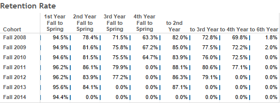
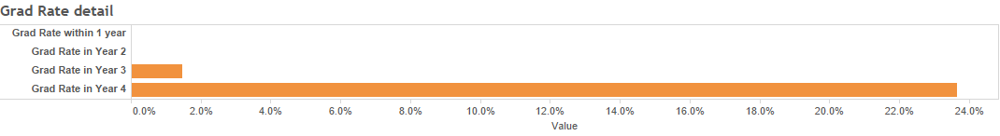
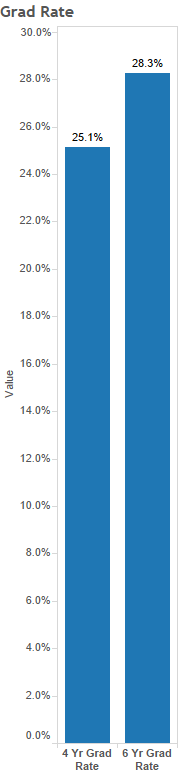

 				
Pb

                
82

                
207.2

                Fixed WebPage CSS
                created new buttons (scratch)
                
                broke the whole site
                rebuilt/debugged site to stable

Green Buttons
Search Box
Updated Report Divs

                access level can't reach all reports
				Search Button
				Contact Button/Form
				Project Button

        Change Buttons to more readable button

              

              

                 
            
 
                

                  

                    <a href="https://dataviz.usfca.edu/#/views/StudentPopulationTrendsbyStateNation/CollegeTrend" target="_blank">
                      
                      

                          <h3 class="content-title">Retention Rate</h3>
                          
student

                          
1

                          
100

                      

                    </a>
                

              

              
              

              

                  

                    <a href="https://dataviz.usfca.edu/#/views/StudentPopulationTrendsbyStateNation/CollegeTrend" target="_blank">
                      
                      

                          <h3 class="content-title">Graduation Details</h3>
                          
student

                          
1

                          
100

                      

                    </a>
                

              

              
         

          

              

                  

                    <a href="https://dataviz.usfca.edu/#/views/StudentPopulationTrendsbyStateNation/CollegeTrend" target="_blank">
                      
                      

                          <h3 class="content-title">Initial Counts</h3>
                          
student

                          
1

                          
100

                      

                    </a>
                

              

              

              

                  

                    <a href="https://dataviz.usfca.edu/#/views/StudentPopulationTrendsbyStateNation/CollegeTrend" target="_blank">
                      
                      

                          <h3 class="content-title">Graduation Rate</h3>
                          
student

                          
1

                          
100

                      

                    </a>
                

              

